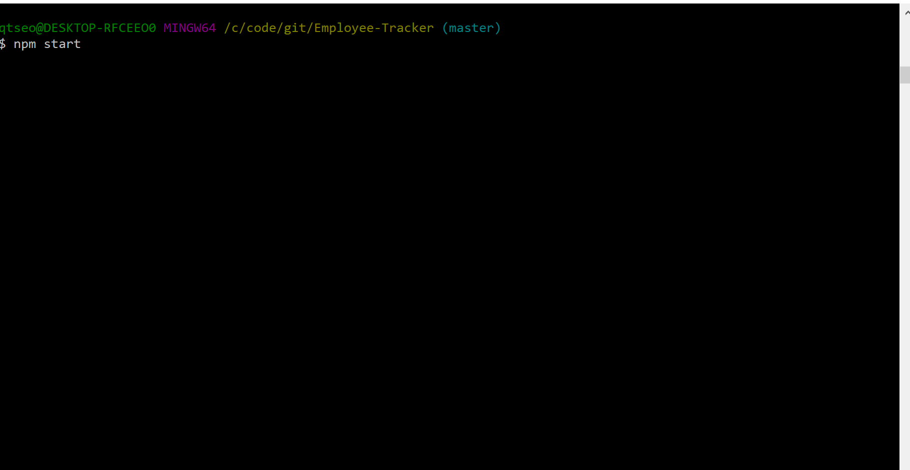

# Employee-Tracker
:page_with_curl: Content Management Systems application that enables users to collect employee information upon their unique request.
 
:mag: Databases queried by users consist of:
* View All Employees
* View All Employees By Department
* View All Employees By Manager
* View the Total Utilized Budget By Department
* View Departments/Roles
* Add Employee/Department/Role
* Update Employee Role/Employee Manager
* Remove Employee/Department/Role 

# Screenshots

# Tech/framework used
* Programming Languages: JavaScript
* Databases: MySQL
* Platform/Framework: Node.js, npm
* Library/Package: Mysql, Inquirer, Console.table, Chalk, Figlet
* Deployment: Git
* Other tools: Visual Studio Code

# Setup
To run this project:
1. Clone to your computer :computer:
<pre> git clone https://github.com/schoe14/Employee-Tracker.git </pre>
2. Install packages :star2:
<pre> npm install </pre>
3. Enter your own password to connect MySQL :unlock:
<pre> const connection = mysql.createConnection({
    host: "localhost",
    // Your port; if not 3306
    port: 3306,
    user: "root",
    password: "Your Password Goes Here",
    database: "employees_DB"
});
</pre>
4. Make sure data in schema.sql and seed.sql goes through MySQL :calling:
5. Command :+1:
<pre> npm start </pre>
